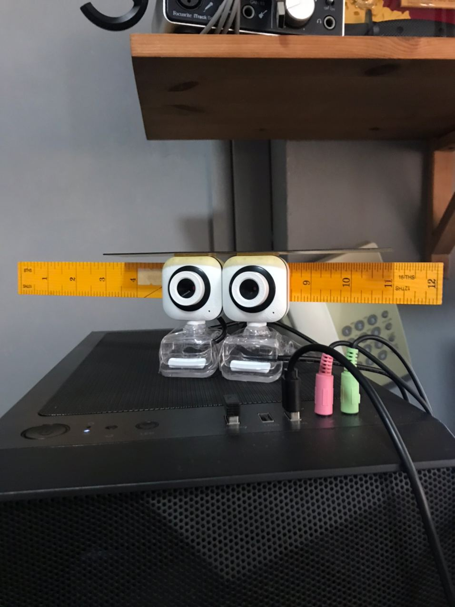

# Stereo Vision
In this project, I try to construct a homemade stereo camera, calibrate it and try to produce a decent depth image using OpenCV.

## Camera
The stereo camera is made up of 2 budget webcams that I've purchased at Sim Lim Square, and are taped onto 2 rulers so that the cameras will be kept in a fixed posture and as aligned as possible.

The cameras are both connected through a USB 2.0 hub, which poses an issue of limited USB bandwidth.
Here is a link for a clearer explanation https://www.zonetrigger.com/articles/USB-overload/USB-bandwidth-troubleshooting.php.
Personally, I just kept trying different ports until it ultimately worked.

## Stage 1 (Taking required images):
- To take images for calibration, comment lines, 19,20,21,30,31,32 and uncomment lines 18 and 29 in capture.py, run code,   and hit enter to take an image.
- To take stereo images, undo the step above and likewise hit enter to take an image. Fill in the filename for the left and right images. 
- Press q to exit.

## Stage 2 (Calibrating Camera and undistorting image):
- Run calibrate.py
- The returned values after calibration are stored in right_camera and left_camera

## Stage 3 (Creating depth image):
- Run disparity.py, adjust the trackbar to tune StereoSGBM_create parameters.
- Press q to exit (parameters will be saved into StereoSGBM_parameters.npy)
- Additionally, I've added the Tsukuba_L and Tsukuba_R images as a control (Change (imgL,imgR) to (TsuL,TsuR) on line 70,72 and 73)

## Final thoughts:
The result for my depth image was a little disappointing and my current level of knowledge limits me to what went wrong,
it'd be nice if someone could try out my codes and educate me on what went wrong. Otherwise, I had a great time reading up and applying cv knowledge that I've acquired last semester. Cheers!
