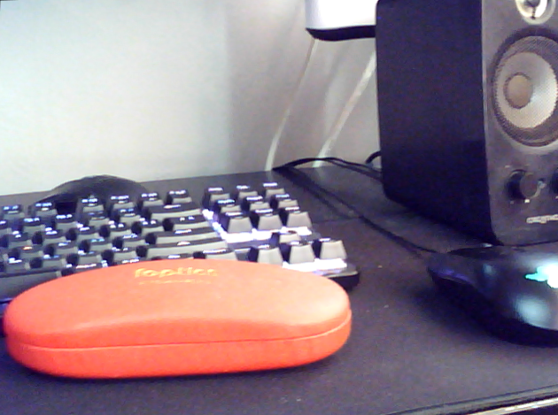

# Stereo Vision

In this project, I try to construct a homemade stereo camera, made up of 2 budget webcams that I've purchased at Sim Lim Sqaure, taped onto a ruler so that I will be able to keep the cameras in a fix posture and furthermore be able to measure the distance between the cameras as well.

